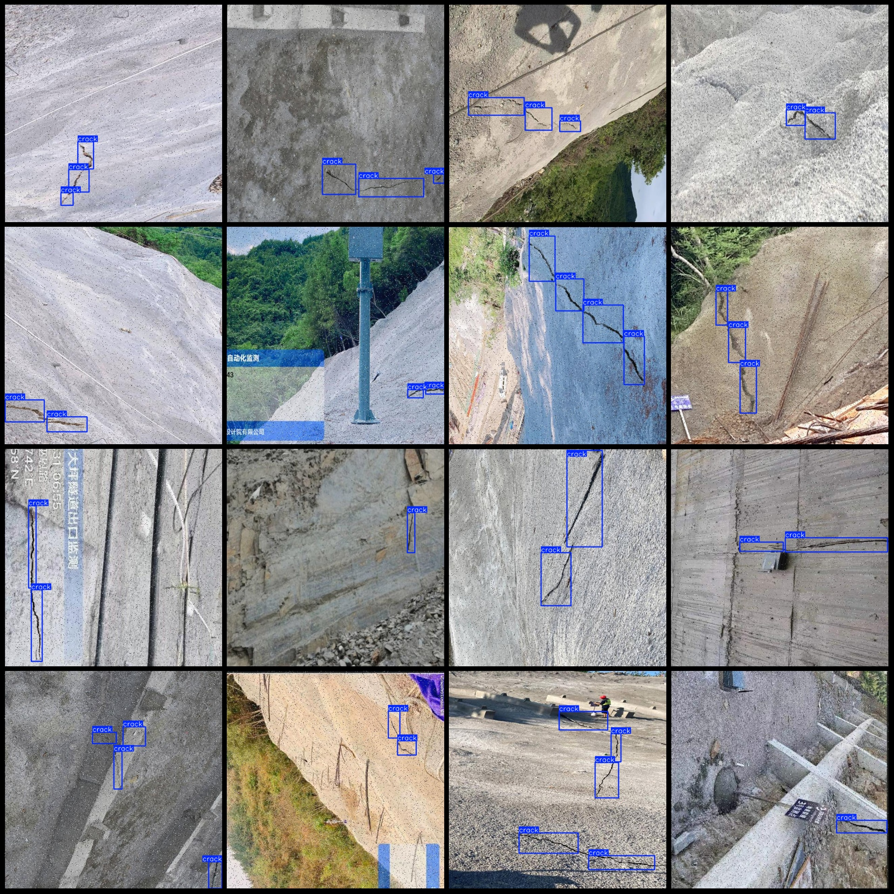
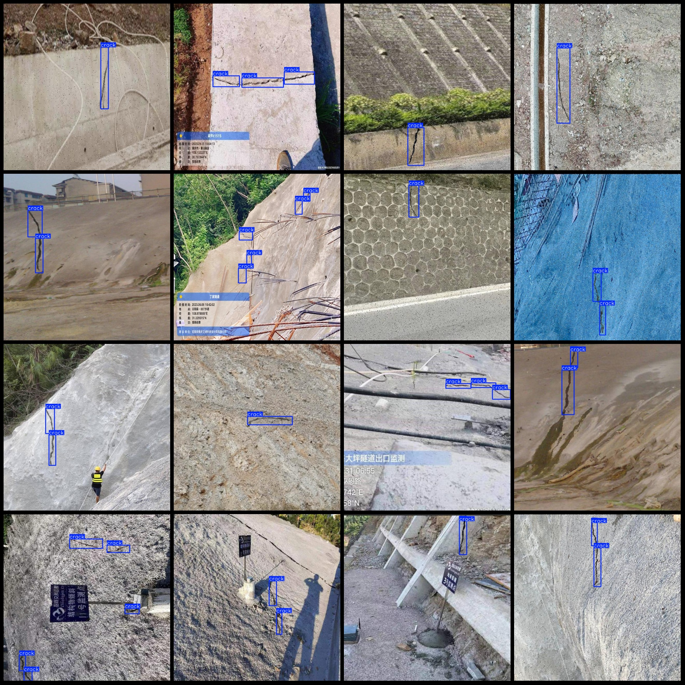

# Slope Cracks and Landslide Hazard Detection Dataset - VOC+YOLO Format: 423 Images in 1 Category

Note that within the dataset, 160 images are originals, while the remaining are enhanced images mainly with salt and pepper noise.

The dataset format follows both Pascal VOC and YOLO specifications (excluding the segmentation path in the text file, only containing JPG images along with their corresponding VOC XML files and YOLO 
txt files).

Number of images (in JPG files): 423
Number of annotations (in XML files): 423
Number of annotations (in txt files): 423
Number of categories: 1
Annotation category name: ["crack"]
Number of bounding box instances per category:
- Crack: 1121
Total number of bounding boxes: 1121
Number of images each category occupies:
- Crack: 423
Image resolution: 640x640
Annotation tool used: labelImg
Annotation rules: drawing rectangles around categories
Special note: The dataset does not have a split into training, validation, or test sets; you will need to do this yourself.
Special declaration: This dataset does not guarantee the accuracy of the trained models or weight files.
Image previews:
Annotation examples:

## Images

Here is a pay link on Stripe ( https://buy.stripe.com/3cs8yP7sY87d0vu9AB ). Please contact me lonlonago@foxmail.com after funding $89, and I will send you a complete data files , thank you!

